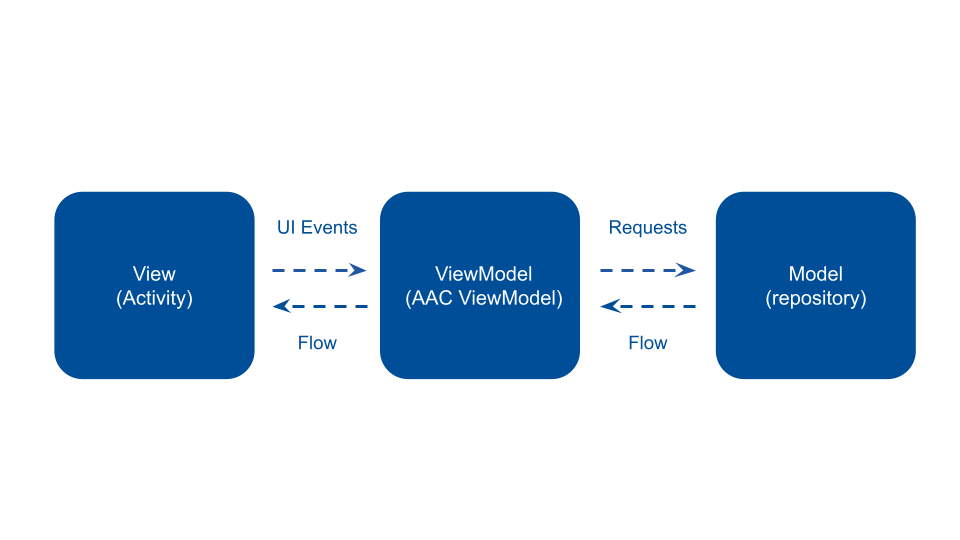

# ビルドの方法

1. Android Studioのメニューの `File > Open` から`Biz-Card-OCR`を開く
2. プロジェクトを開いたら `File > Sync Project With Gradle File` を実行
3. Syncが終了したら、`Run App` もしくは `Make Project` を実行してビルドができることを確認する

# プロジェクトの構成について

## アーキテクチャについての概要

アプリのアーキテクチャはMVVMに沿って実装されている。

- View <- ViewModelはCoroutineFlowを用いてデータが通知される
    - ActivityではViewBindingを用いてデータを反映している
- ViewModel <- ModelもCoroutineFlowを用いてデータが通知される
    - APIリクエストやデータの保存をリクエストして、データが変更されると結果が通知される設計になってる

## パッケージとその内容

### ui

- ActivityとViewModelが配置
- Activity - ViewModel間で通知されるデータはStateもしくはEventとして定義

### domain

- アプリ内で共通のデータモデル
- Androidやライブラリに依存しない

### data

- networkとrepositoryが配置
- networkパッケージにはOCRで使うVisionAPIを呼び出すためのRetrofitのコードを配置
- repositoryパッケージにはrepositoryクラスが配置されており、API呼び出しやローカルデータの読み書きのコードが書かれている
- ローカルデータは課題提供段階では永続化されていない