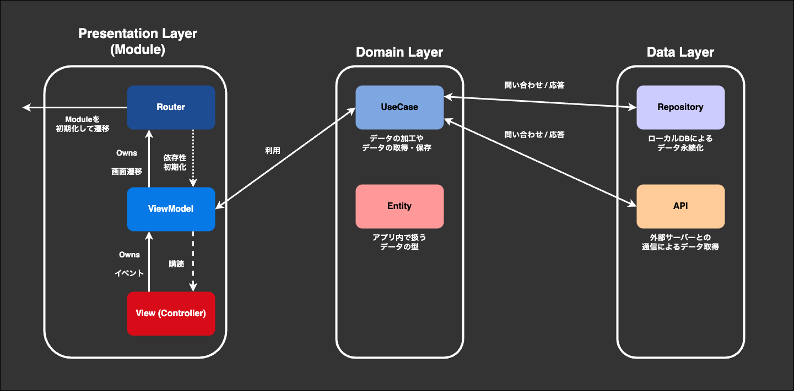

# Sansan One-Day iOS Application
Sansanのモバイル1DayインターンのiOSプロジェクトです。

## 開発環境

- Xcode: `15.2` (`15.4`でも動作を確認)
- mise: `2024.4.4 macos-arm64 (2024-04-11)`

特定バージョンのXcodeをインストールする方法としては､Apple Developerの公式ページからダウンロードする方法と､OSSかアプリケーションからダウンロードする方法があります｡

### Apple Developerからダウンロードする

- 以下のページから､`コマンドラインツールおよびXcodeの旧バージョン` に飛び任意のバージョンのXcodeをダウンロードできます
- <https://developer.apple.com/jp/xcode/resources/>

### OSSアプリケーションを利用する

- 以下のアプリケーションをダウンロードしアプリケーション内にてAppleIDでログインすることで､任意のバージョンのXcodeをダウンロードできます
- <https://github.com/XcodesOrg/XcodesApp>

## 動作環境

このアプリを実行できる最低OSバージョンは以下となっています｡

- deployment target: iOS 16.0

## 環境構築

1. miseを利用可能にする
    - ※ プロジェクト管理ライブラリにTuistを利用しており、その推奨管理方法のため
    - https://github.com/jdx/mise
    - https://mise.jdx.dev/getting-started.html
    - 以下のに出力されればOK
    ```
    mise -V // 2024.4.4 macos-arm64 (2024-04-11)
    ```
2. miseでTuist環境をセットアップする
    1. プロジェクトの `Sansan-OneDay` 配下、`.mise.toml` があるディレクトリに移動する
    2. `mise install` を実行する. `.mise.toml` に記述された依存ライブラリが環境としてインストールされる
3. Configを準備する
    1. `SansanOneDay/Resources` 配下に `Config.xcconfig.template` というファイルがあるので、そのファイル名を変更し `Config.xcconfig` にリネームしてください
    2. `GOOGLE_API_KEY` は当日に発行します
4. Tuistでプロジェクトを生成する
    - https://github.com/tuist/tuist
    - https://docs.tuist.io/
    - TuistはSwiftでプロジェクト構成を記述し、ワークスペース、プロジェクト、`info.plist` からビルド設定までを構築することができる。
    1. 基本的に `tuist generate` を実行すればよい
    2. 成功すると自動的にワークスペースが開かれるのでそのまま開発すればOK
    ※ もし失敗する場合、`tuist install` を実行し、依存物をダウンロードしてみてください。

    まとめ(基本以下のコマンドを実行すれば環境ができあがるはず)
    ```
    brew install mise

    echo 'eval "$(~/.local/bin/mise activate zsh)"' >> ~/.zshrc

    cd Sansan-OneDay

    mise install

    tuist generate
    ```

## このアプリについて

**名刺画像をOCRした後に名刺要素を抽出し名刺として保存するアプリです**

### 画面

- 名刺一覧画面 (BizCardList)
    - 端末内に保存されている名刺を読み込み一覧として表示する
    - タップされた名刺の詳細画面への遷移を行う
- 名刺撮影画面 (BizCardCapture)
    - 端末のカメラを利用して画像を撮影する
    - プレビュー内の青枠線にそって撮影した画像をトリミングする
- 名刺詳細画面 (BizCardDetail)
    - 名刺詳細
        - 既に端末内にある名刺情報を表示する
- 名刺編集画面 (BizCardEdit)
    - 名刺作成
        - 画面の引数として名刺画像を受け取った後､OCRを行い名刺情報の作成を行う
    - 名刺編集
        - 既に端末内にある名刺情報を編集し再保存する

## アーキテクチャ

**MVVMをベースにClean Architectureを参考にしたものになっています**

- [MVVM+CreanArchtecture](https://github.com/kudoleh/iOS-Clean-Architecture-MVVM)



### Router

- ViewModelから画面遷移の命令が来たら､別のModuleへの遷移を行う

### ViewModel

- Viewからのイベントに応じてプレゼンテーションロジックを実行し､Viewの状態を変更する
- 必要に応じてUseCaseを用いてデータの取得や処理を行う
- Routerを所持することで､プレゼンテーションロジックによる処理後に画面遷移を行うことが可能

### View (Controller)

- 画面のレイアウトを行う
- 状態に応じて変化する要素はViewModelに従う

### UseCase

- プレゼンテーションロジック以外のビジネスロジックの実装を行う
- データの変換処理や､データ取得処理等

### Entity

- アプリ内で共通のデータモデル
- APIからのレスポンス等もここでDecodableに準拠したモデルにする

### Repository

- アプリ内で複数のモジュールで必要なデータや永続化が必要なデータを保持する
- データの永続化にはRealm, CoreData, SQLite, UserDefaults等を用いる方法が一般的です

### API

- 外部のAPIサーバーと通信を行う｡
